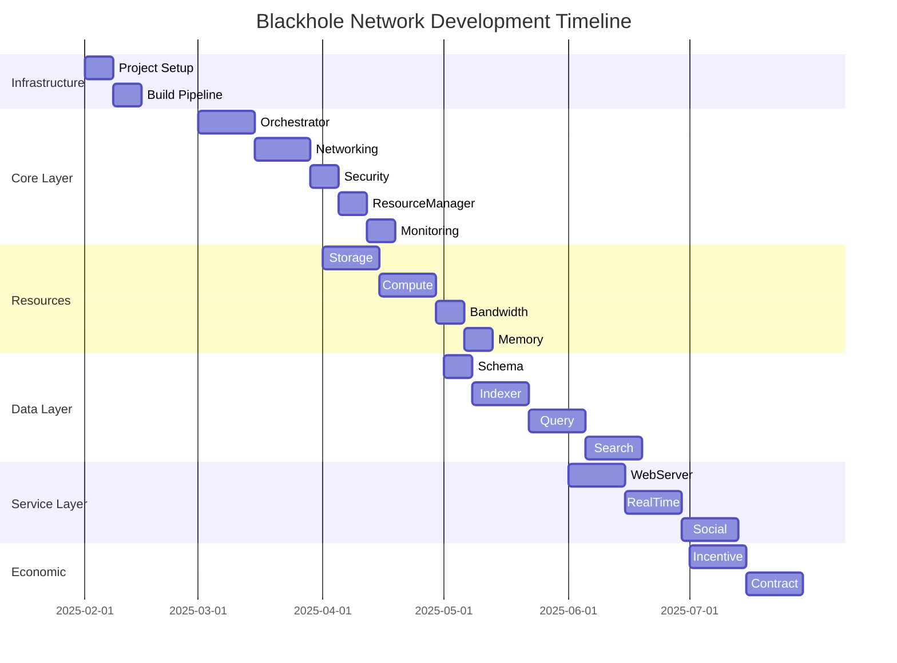

# Blackhole Network - Technical Architecture

## System Architecture Overview

### 1. Core Design Pattern: Plugin-Based Monolith

The system is built as a monolithic application with a plugin-based architecture, allowing modular development while maintaining deployment simplicity for home users.

```go
// Core plugin interface that all components implement
type Component interface {
    Name() string
    Dependencies() []string
    Start(ctx context.Context) error
    Stop(ctx context.Context) error
    Health() ComponentHealth
}

// Orchestrator manages all components
type Orchestrator struct {
    components map[string]Component
    graph      *DependencyGraph
    config     *Config
}
```

### 2. Layered Implementation Strategy

#### Project Structure
```
cmd/blackhole/
├── main.go              # Entry point
├── Makefile            # Build automation
└── .github/workflows/  # CI/CD

pkg/
├── core/               # Core layer components
│   ├── orchestrator/
│   ├── networking/
│   ├── security/
│   ├── resource/
│   └── monitoring/
├── resources/          # Resources layer
│   ├── storage/
│   ├── compute/
│   ├── bandwidth/
│   └── memory/
├── data/              # Data layer
│   ├── schema/
│   ├── indexer/
│   ├── query/
│   └── search/
├── service/           # Service layer
│   ├── webserver/
│   ├── realtime/
│   └── social/
└── economic/          # Economic layer
    ├── incentive/
    └── contract/
```

#### Phase 1: Core Layer - The Brain

**Orchestrator**
- Event-driven state machine managing component lifecycle
- Dependency resolution and startup sequencing
- Health monitoring with automatic recovery

**Networking**
- libp2p node with DHT discovery
- PubSub for event propagation
- NAT traversal with relay fallback

**Security**
- DID-based identity management
- JWT tokens for internal service auth
- End-to-end encryption for user data

**ResourceManager**
- Priority queue system with economic tiers
- Load-based allocation decisions
- Resource usage tracking and limits

**Monitoring**
- OpenTelemetry integration
- Prometheus metrics export
- Real-time dashboard with Grafana

#### Phase 2: Resources Layer - The Muscles

```go
// Unified resource interface
type Resource interface {
    Type() ResourceType
    Available() uint64
    Allocate(amount uint64, priority Priority) (*Allocation, error)
    Release(allocationID string)
}

// Storage uses content-addressed chunks
type StorageResource struct {
    chunks  map[CID]*Chunk
    erasure *ReedSolomon
    vfs     *VirtualFS
}

// Compute handles job execution
type ComputeResource struct {
    workers  []*Worker
    queue    *PriorityQueue
    limiter  *RateLimiter
}
```

#### Phase 3: Data Layer - The Memory

**Schema Management**
- Protocol Buffers for schema evolution
- Versioned schemas with backward compatibility
- Automatic migration support

**Indexer**
- Bleve engine with distributed sharding
- Bloom filters for efficient lookups
- Consistent hashing for shard distribution

**Query Engine**
- SQL parser translating to distributed operations
- Query optimization with cost-based planning
- Result aggregation from multiple nodes

**Search**
- Embedding-based similarity search
- FAISS integration for vector search
- ML model for query understanding

#### Phase 4: Service Layer - The Interface

```go
// Fiber-based API server
app := fiber.New(fiber.Config{
    Prefork:       true,
    ServerHeader:  "Blackhole",
    StrictRouting: true,
})

app.Use(middleware.Logger())
app.Use(middleware.Recover())
app.Use(middleware.CORS())
app.Use(middleware.Auth())
app.Use(middleware.RateLimit())

// WebSocket hub for real-time
hub := &Hub{
    clients:    make(map[*Client]bool),
    broadcast:  make(chan []byte),
    register:   make(chan *Client),
    unregister: make(chan *Client),
}

// WebRTC signaling server
signal := &SignalServer{
    peers:     make(map[string]*Peer),
    offer:     make(chan *Offer),
    answer:    make(chan *Answer),
    candidate: make(chan *ICECandidate),
}
```

#### Phase 5: Economic Layer - The Heart

**Incentive System**
- Real-time pricing based on supply/demand
- Automatic payment distribution
- Fraud detection and prevention

**Contract Management**
- State machine for subscription tiers
- SLA enforcement with penalties
- Automatic tier upgrades/downgrades

### 3. Key Technical Solutions

#### A. P2P Network Topology

```
┌─────────┐     libp2p      ┌─────────┐
│ Node A  │ ←─────────────→ │ Node B  │
└────┬────┘                 └────┬────┘
     │                           │
     ├── DHT Discovery ──────────┤
     │                           │
     ├── PubSub Events ──────────┤
     │                           │
     └── Direct Streams ─────────┘
```

#### B. Storage Architecture

```
File Upload
    ↓
Chunking (1MB pieces)
    ↓
Erasure Coding (10+4 Reed-Solomon)
    ↓
CID Generation (Content addressing)
    ↓
Distribution to Nodes
    ↓
VFS Metadata Update
```

**Erasure Coding Benefits**:
- 10 data chunks + 4 parity chunks
- Can recover from any 4 node failures
- 40% storage overhead for high availability

#### C. Load-Aware Resource Allocation

```go
func (rm *ResourceManager) Allocate(job Job) error {
    priority := rm.getUserPriority(job.UserID)
    
    // Economic tiers get priority
    // Ultimate > Advance > Normal > Free
    queue := rm.queues[priority]
    queue.Push(job)
    
    // Allocate based on current load
    load := rm.currentLoad()
    if load < 0.8 {
        return rm.executeJob(job)
    } else if priority >= PriorityAdvance && load < 0.95 {
        return rm.executeJob(job)
    }
    
    return ErrQueuedForLaterExecution
}

func (rm *ResourceManager) currentLoad() float64 {
    cpu := rm.monitor.CPUUsage()
    mem := rm.monitor.MemoryUsage()
    net := rm.monitor.NetworkUsage()
    
    // Weighted average
    return (cpu*0.4 + mem*0.4 + net*0.2)
}
```

#### D. Universal Data Layer

```
Application Layer
       ↓
Standard Schema (Protobuf)
       ↓
Bleve Index (Distributed)
       ↓
Any Storage Node
       ↓
User DID Authorization
       ↓
Data Portability
```

### 4. Development Approach

#### Test-Driven Development

1. **Integration Tests First**
   ```go
   func TestComponentLifecycle(t *testing.T) {
       orchestrator := NewOrchestrator()
       component := NewMockComponent()
       
       err := orchestrator.Register(component)
       require.NoError(t, err)
       
       err = orchestrator.Start()
       require.NoError(t, err)
       
       health := orchestrator.Health()
       assert.Equal(t, HealthyStatus, health)
   }
   ```

2. **Minimal Implementation**
3. **Unit Tests for Edge Cases**
4. **Performance Optimization**

#### Incremental Releases

| Version | Features | Target Date |
|---------|----------|-------------|
| v0.1 | Basic node with storage sharing | Mar 2025 |
| v0.2 | Add compute capabilities | Apr 2025 |
| v0.3 | Data layer with search | May 2025 |
| v0.4 | Web dashboard and APIs | Jun 2025 |
| v0.5 | Economic incentives | Jul 2025 |
| v1.0 | Production ready | Aug 2025 |

### 5. Critical Design Decisions

| Decision | Choice | Rationale |
|----------|--------|-----------|
| Architecture | Monolithic | Easier deployment on home computers |
| Storage | Custom VFS | Flexibility over using a database |
| Consensus | Eventual consistency | No blockchain complexity |
| Network | libp2p | Proven P2P infrastructure |
| Economic | Credit system | Simpler than cryptocurrency initially |
| Language | Go | Performance + single binary |

### 6. Major Technical Challenges & Solutions

#### Challenge: Unreliable Home Networks (50-80% uptime)
**Solution**: 
- Erasure coding (10+4) ensures availability with 40% nodes offline
- Automatic replication when nodes drop below threshold
- Predictive pre-replication based on node behavior

#### Challenge: Resource Allocation Fairness
**Solution**:
- Multi-tier priority queues with economic incentives
- Resource reservations for paying users
- Fair queuing algorithm preventing starvation

#### Challenge: Search Across Distributed Data
**Solution**:
- Distributed Bleve shards with consistent hashing
- Bloom filters for efficient existence checks
- Query routing based on data locality

#### Challenge: Real-time Communication Through NATs
**Solution**:
- STUN/TURN servers for NAT traversal
- libp2p relay as fallback
- WebRTC for browser compatibility

#### Challenge: Data Integrity and Security
**Solution**:
- Content addressing prevents tampering
- End-to-end encryption for privacy
- Regular integrity checks with self-healing

### 7. Production Considerations

#### Auto-Update System
```go
type Updater struct {
    current   Version
    checker   *GitHubReleaseChecker
    installer *Installer
}

func (u *Updater) CheckAndUpdate() error {
    latest, err := u.checker.LatestRelease()
    if err != nil {
        return err
    }
    
    if latest.GreaterThan(u.current) {
        return u.installer.Update(latest)
    }
    
    return nil
}
```

#### Graceful Degradation
- Core functions remain available during partial failures
- Automatic service level reduction under load
- User notification of degraded performance

#### Resource Limits
```yaml
# Default resource limits
resources:
  cpu:
    max_percent: 80
    reserved_percent: 20
  memory:
    max_gb: 8
    reserved_gb: 2
  bandwidth:
    max_mbps: 100
    reserved_mbps: 10
  storage:
    max_gb: 500
    reserved_gb: 50
```

#### Privacy & Security
- End-to-end encryption for user data
- No logging of user activities
- Regular security audits
- Responsible disclosure program

#### Monitoring Dashboard
- Built-in Grafana dashboards
- Real-time resource usage
- Network health visualization
- Economic earnings tracking

### 8. Implementation Timeline



### 9. Success Criteria

- **Performance**: Handle 10,000 concurrent nodes
- **Reliability**: 99.9% data availability with 60% nodes online
- **Scalability**: Linear scaling with node count
- **Usability**: One-click installation and setup
- **Economic**: Profitable for average home user

This architecture provides a solid foundation that's both ambitious and achievable, focusing on gradual value delivery while building toward the complete vision of a truly decentralized infrastructure platform.