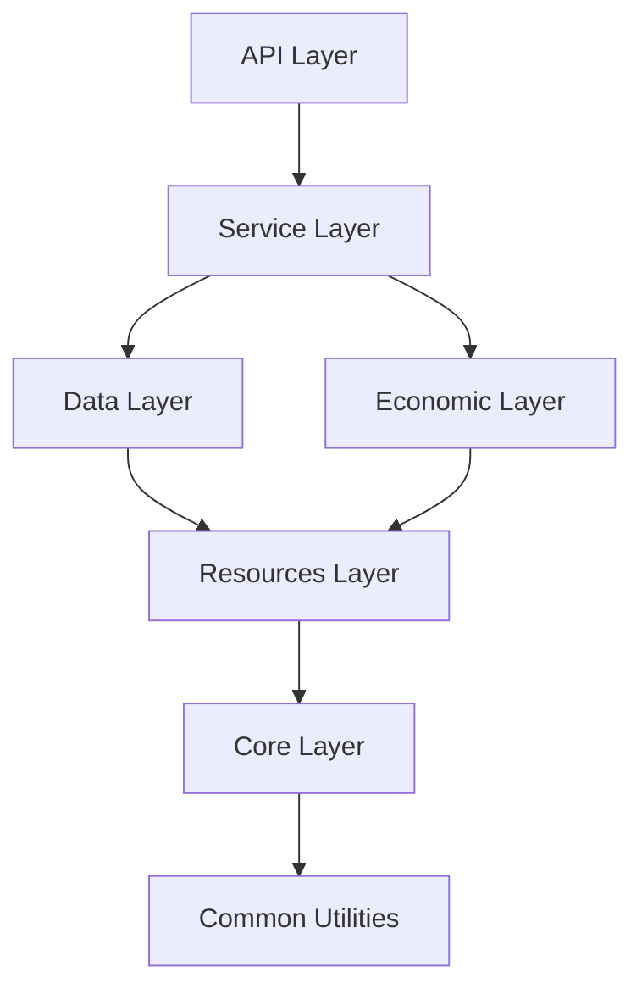

# Module Boundaries and Dependencies

This document defines clear boundaries between modules to prevent circular dependencies and maintain clean architecture.

## Dependency Rules

```
cmd/
  ↓ (can import from)
pkg/
  ↓ (can import from)
internal/
  ↓ (can import from)
common/
```

**NEVER**: 
- common → pkg (would create circular dependency)
- internal → pkg (internal is for shared utilities)
- Any circular imports

## Module Boundaries

### 1. Core Modules (pkg/core/)

```go
// ✅ ALLOWED: Core modules can depend on each other with clear hierarchy
orchestrator → security, monitoring, resource
security → (no dependencies on other core)
monitoring → (no dependencies on other core)
resource → monitoring

// ❌ FORBIDDEN: No circular dependencies
security → orchestrator → security  // NEVER!
```

### 2. Layer Dependencies



### 3. Cross-Cutting Concerns

```go
// Events - Use event bus, not direct imports
package storage

import "github.com/blackhole/pkg/events"

// ❌ WRONG - Direct dependency
import "github.com/blackhole/pkg/search"

func (s *Storage) NotifySearch() {
    search.UpdateIndex() // Creates coupling
}

// ✅ CORRECT - Event-driven
func (s *Storage) NotifySearch() {
    s.eventBus.Publish(FileStoredEvent{...})
}
```

### 4. Interface Ownership

**Rule**: The consumer owns the interface

```go
// ❌ WRONG - Provider owns interface
package storage

type Storage interface {
    GetFile(id string) (*File, error)
    StoreFile(data []byte) (string, error)
    DeleteFile(id string) error
    // 20 more methods...
}

// ✅ CORRECT - Consumer owns interface
package api

type StorageService interface {
    GetFile(ctx context.Context, id string) (*File, error)
    StoreFile(ctx context.Context, data []byte) (string, error)
}

// Different consumer, different interface
package compute

type StorageReader interface {
    GetFile(ctx context.Context, id string) (io.ReadCloser, error)
}
```

### 5. Package Cohesion Rules

**High Cohesion**: Everything in a package should be related

```go
// ❌ WRONG - Mixed concerns in one package
package utils
- StringUtils
- FileUtils  
- NetworkUtils
- CryptoUtils

// ✅ CORRECT - Focused packages
package crypto
- Encrypt()
- Decrypt()
- GenerateKey()

package network  
- Dial()
- Listen()
- Discover()
```

### 6. Dependency Injection Points

```go
// All dependencies injected at startup
func main() {
    // Create core services
    storage := storage.New(config.Storage)
    network := network.New(config.Network)
    
    // Create higher-level services with dependencies
    api := api.New(
        api.WithStorage(storage),
        api.WithNetwork(network),
    )
    
    // Start orchestrator with all services
    orchestrator := orchestrator.New(
        orchestrator.RegisterComponent("storage", storage),
        orchestrator.RegisterComponent("network", network),
        orchestrator.RegisterComponent("api", api),
    )
    
    orchestrator.Start()
}
```

## Testing Boundaries

### Unit Tests
- Test packages in isolation
- Mock all external dependencies
- No real network/disk I/O

### Integration Tests  
- Test module interactions
- Use real implementations
- Test through public interfaces only

### System Tests
- Test entire system
- Multiple nodes
- Real network conditions

## Enforcement

### Build-Time Checks

```go
// tools/depcheck/main.go
package main

import "golang.org/x/tools/go/packages"

func main() {
    // Check for circular dependencies
    // Check for forbidden imports
    // Check for layer violations
}
```

### CI Pipeline

```yaml
- name: Check Dependencies
  run: |
    go mod graph | grep -E "cycle|circular" && exit 1
    go run tools/depcheck/main.go
```

## Common Violations and Fixes

### 1. Circular Dependency
```go
// Problem: A → B → A

// Solution 1: Extract interface
// Solution 2: Use events
// Solution 3: Extract common functionality
```

### 2. Layer Violation
```go
// Problem: Resources layer importing from Service layer

// Solution: Move shared functionality to Core or Common
```

### 3. God Package
```go
// Problem: Package with 50+ files

// Solution: Split into focused sub-packages
```

This architecture ensures modules remain loosely coupled and highly cohesive.