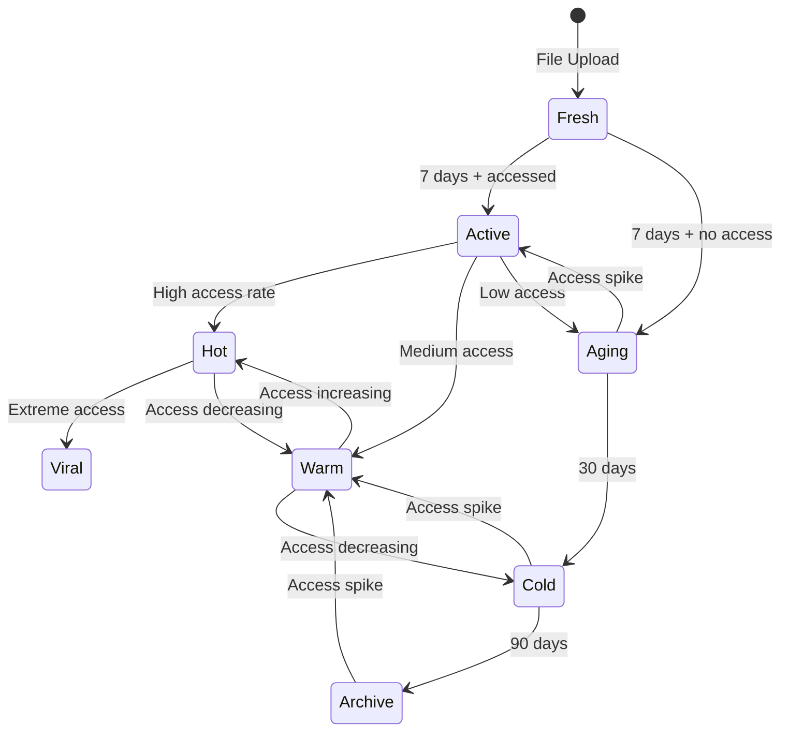

# Adaptive Erasure Coding Design

## Core Principle: Dynamic Redundancy Based on File Lifecycle

Instead of static erasure coding parameters, we adapt redundancy based on:
1. **Time since last access** (decay over time)
2. **Access frequency** (popularity)
3. **Access patterns** (burst vs steady)

## Baseline Requirements

### Initial Upload (All Files)
- **Minimum**: 30% redundancy tolerance
- **Default**: 10+5 encoding (33% loss tolerance)
- **Rationale**: Ensure all files start with high availability

## Adaptive Redundancy Model

### 1. Time-Based Decay

```
Age Brackets:
- Fresh (0-7 days): Maintain baseline (10+5)
- Active (7-30 days): Maintain if accessed, else reduce
- Aging (30-90 days): Reduce to 10+3 (23% tolerance)
- Cold (90-365 days): Reduce to 10+2 (16% tolerance)
- Archive (>365 days): Reduce to 10+1 (9% tolerance)
```

### 2. Popularity-Based Amplification

```
Access Frequency Tiers:
- Viral (>1000 accesses/day): Boost to 10+10 (50% tolerance)
- Hot (100-1000 accesses/day): Boost to 10+8 (44% tolerance)
- Warm (10-100 accesses/day): Boost to 10+6 (37% tolerance)
- Normal (1-10 accesses/day): Maintain baseline (10+5)
- Cold (<1 access/day): Allow decay per age
```

### 3. Access Pattern Recognition

```python
# Burst Detection
if accesses_last_hour > 10 * daily_average:
    # Preemptively increase redundancy
    boost_redundancy_immediately()

# Steady Popular
if daily_accesses > 100 for 7 consecutive days:
    # Permanent boost until access drops
    set_minimum_redundancy(10+8)

# Scheduled Access (e.g., backups)
if access_pattern_matches_schedule():
    # Pre-warm before expected access
    increase_redundancy_before_scheduled_time()
```

## Implementation Architecture

### 1. Metadata Structure

```yaml
file_metadata:
  hash: "abc123..."
  size: 104857600
  created_at: "2025-01-29T10:00:00Z"

  redundancy:
    current:
      data_chunks: 10
      parity_chunks: 5  # Current actual redundancy
      distribution_width: 15  # Number of unique nodes

    target:
      parity_chunks: 8  # Target based on popularity
      distribution_width: 30  # Target node spread

    history:
      - timestamp: "2025-01-29T10:00:00Z"
        parity_chunks: 5
        reason: "initial_upload"
      - timestamp: "2025-02-05T10:00:00Z"
        parity_chunks: 8
        reason: "popularity_boost"

  access_metrics:
    last_accessed: "2025-02-10T15:30:00Z"
    access_count_total: 15420
    access_count_24h: 342
    access_count_7d: 2103
    unique_accessors_24h: 89

  lifecycle:
    stage: "hot"  # fresh|active|warm|cold|archive
    next_evaluation: "2025-02-11T10:00:00Z"
    decay_scheduled: null
```

### 2. Redundancy State Machine



### 3. Redundancy Adjustment Algorithm

```go
func (s *Storage) adjustRedundancy(fileHash string) error {
    metadata := s.getMetadata(fileHash)
    metrics := s.getAccessMetrics(fileHash)

    // Calculate target redundancy
    target := s.calculateTargetRedundancy(metadata, metrics)

    current := metadata.Redundancy.Current.ParityChunks

    if target.ParityChunks > current {
        // Need to increase redundancy
        return s.increaseRedundancy(fileHash, current, target)
    } else if target.ParityChunks < current - 2 {
        // Only decrease if difference is significant
        return s.decreaseRedundancy(fileHash, current, target)
    }

    return nil
}

func (s *Storage) calculateTargetRedundancy(metadata, metrics) RedundancyTarget {
    baselineParity := 5  // 33% loss tolerance

    // Time-based decay
    daysSinceAccess := time.Since(metrics.LastAccessed).Hours() / 24
    var timeFactor float64
    switch {
    case daysSinceAccess < 7:
        timeFactor = 1.0
    case daysSinceAccess < 30:
        timeFactor = 0.8
    case daysSinceAccess < 90:
        timeFactor = 0.6
    case daysSinceAccess < 365:
        timeFactor = 0.4
    default:
        timeFactor = 0.2
    }

    // Popularity boost
    accessRate := float64(metrics.AccessCount24h)
    var popularityFactor float64
    switch {
    case accessRate > 1000:
        popularityFactor = 2.0
    case accessRate > 100:
        popularityFactor = 1.6
    case accessRate > 10:
        popularityFactor = 1.2
    default:
        popularityFactor = 1.0
    }

    // Calculate final parity chunks
    targetParity := int(float64(baselineParity) * timeFactor * popularityFactor)

    // Enforce minimum and maximum
    if targetParity < 1 {
        targetParity = 1  // Never go below 10+1
    } else if targetParity > 10 {
        targetParity = 10  // Cap at 10+10 (50% tolerance)
    }

    // Calculate distribution width
    distributionWidth := 15  // Default
    if popularityFactor > 1.5 {
        distributionWidth = 30  // Spread popular files wider
    } else if timeFactor < 0.5 {
        distributionWidth = 10  // Consolidate cold files
    }

    return RedundancyTarget{
        ParityChunks:      targetParity,
        DistributionWidth: distributionWidth,
    }
}
```

### 4. Operations

#### Increasing Redundancy
```go
func (s *Storage) increaseRedundancy(fileHash string, current, target int) error {
    // 1. Retrieve current data chunks
    chunks := s.retrieveDataChunks(fileHash)

    // 2. Generate additional parity chunks
    additionalParity := target.ParityChunks - current
    newParityChunks := s.erasureEncoder.GenerateAdditionalParity(
        chunks,
        additionalParity,
    )

    // 3. Distribute new parity chunks
    // Prefer nodes in different geographic regions
    nodes := s.selectNodesForRedundancy(target.DistributionWidth)
    s.distributeChunks(newParityChunks, nodes)

    // 4. Update metadata
    s.updateRedundancyMetadata(fileHash, target, "popularity_boost")

    return nil
}
```

#### Decreasing Redundancy
```go
func (s *Storage) decreaseRedundancy(fileHash string, current, target int) error {
    // 1. Identify parity chunks to remove
    toRemove := current - target.ParityChunks
    chunks := s.getParityChunks(fileHash)

    // 2. Select chunks to remove (oldest first)
    removeList := chunks[len(chunks)-toRemove:]

    // 3. Send removal requests to nodes
    for _, chunk := range removeList {
        s.requestChunkRemoval(chunk)
    }

    // 4. Update metadata
    s.updateRedundancyMetadata(fileHash, target, "time_decay")

    return nil
}
```

### 5. Monitoring and Triggers

```go
// Background job running every hour
func (s *Storage) redundancyOptimizer() {
    for {
        files := s.getFilesForRedundancyCheck()

        for _, file := range files {
            metrics := s.getAccessMetrics(file.Hash)

            // Check if adjustment needed
            if s.shouldAdjustRedundancy(file, metrics) {
                s.adjustRedundancy(file.Hash)
            }
        }

        time.Sleep(1 * time.Hour)
    }
}

// Real-time trigger on access
func (s *Storage) handleFileAccess(fileHash string) {
    // Update access metrics
    s.incrementAccessCount(fileHash)

    // Check for burst pattern
    if s.detectAccessBurst(fileHash) {
        // Immediate boost
        s.boostRedundancyImmediate(fileHash)
    }
}
```

## Economic Implications

### 1. Storage Pricing
```
Base price per chunk per month: 10 tokens

Modifiers:
- Parity chunk: 1.2x (incentivize parity storage)
- Hot file chunk: 1.5x (higher bandwidth costs)
- Geographic diversity: 1.1x (reward remote storage)
```

### 2. Dynamic Pricing
```python
def calculate_storage_price(chunk_type, file_metrics):
    base_price = 10

    # Parity premium
    if chunk_type == "parity":
        base_price *= 1.2

    # Popularity premium
    if file_metrics.access_count_24h > 100:
        base_price *= 1.5
    elif file_metrics.access_count_24h > 10:
        base_price *= 1.2

    # Age discount
    days_old = (now() - file_metrics.created_at).days
    if days_old > 365:
        base_price *= 0.5  # 50% discount for archive
    elif days_old > 90:
        base_price *= 0.7  # 30% discount for cold

    return base_price
```

### 3. Incentive Alignment
- **Popular files pay more**: Higher revenue for storing in-demand content
- **Cold files pay less**: Reduce network costs for rarely accessed data
- **Parity premium**: Ensures redundancy is maintained
- **Burst handling**: Extra rewards for nodes that help during traffic spikes

## Benefits of This Approach

1. **Efficient Resource Usage**
   - Popular files get more redundancy when needed
   - Cold files don't waste network resources
   - Automatic optimization without user intervention

2. **Better Availability**
   - Popular content spreads wider for load distribution
   - Predictive boosting prevents availability issues
   - Geographic distribution for global access

3. **Economic Efficiency**
   - Storage costs decrease for old files
   - Popular content generates more revenue
   - Natural garbage collection of unused files

4. **Network Health**
   - Prevents hot spots by spreading popular content
   - Reduces repair traffic for stable files
   - Incentivizes long-term reliable storage

## Implementation Phases

### Phase 1: Time-Based Decay Only
- Implement basic age-based redundancy reduction
- Monitor impact on repair traffic
- Gather access pattern data

### Phase 2: Popularity Boosting
- Add access counting and metrics
- Implement redundancy increase for hot files
- Test burst detection algorithms

### Phase 3: Predictive Adjustments
- Machine learning for access prediction
- Preemptive redundancy adjustments
- Schedule-aware optimization

### Phase 4: Economic Integration
- Dynamic pricing based on redundancy
- Market-based chunk placement
- Automated storage auctions

## Monitoring Metrics

```yaml
redundancy_metrics:
  - files_by_redundancy_level
  - average_parity_chunks
  - redundancy_adjustment_rate
  - repair_traffic_volume
  - access_pattern_distribution
  - storage_cost_by_file_age
  - node_churn_impact
  - popularity_prediction_accuracy
```

This adaptive system ensures efficient use of network resources while maintaining availability where it matters most.
